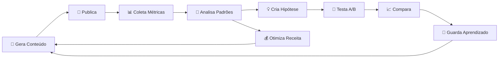
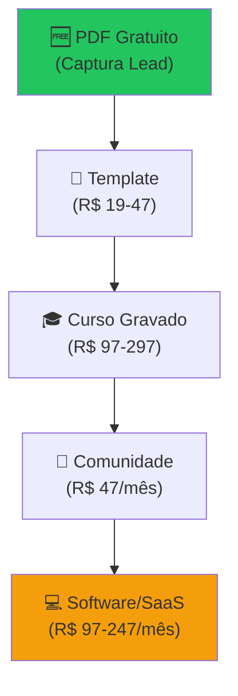

# 🗺️ PLANO DE AÇÃO CONSOLIDADO — Bot Instagram → Máquina de Vendas

> [!NOTE]
> Este plano foi construído analisando **todos os 6 documentos** da pasta `Importante-negocio` e cruzando com o **estado real do código** no repositório. Ele elimina redundâncias, organiza por prioridade e dá clareza sobre o que já existe vs. o que falta construir.

---

## 📍 DIAGNÓSTICO: ONDE ESTAMOS HOJE

### ✅ O que já funciona (não mexer)

| Módulo | Arquivo(s) | Status |
|--------|-----------|--------|
| **Motor de IA** | `core/ai/gemini.py`, `prompts.py`, `styles.py` | ✅ Operacional — Gera copy via Gemini com rotação de chaves |
| **Motor Visual** | `core/design/motor_visual.py`, `templates.py`, `efeitos.py` | ✅ Operacional — Cria imagens com Pillow |
| **Publicador** | `core/publisher/instagram.py`, `uploader.py` | ✅ Operacional — Publica via Meta Graph API |
| **Notificações** | `core/publisher/email_notifier.py` | ✅ Operacional — Alertas por email |
| **Analytics** | `core/analytics/coletor.py`, `analisador.py`, `ajustador.py` | ✅ Operacional — Feedback loop básico |
| **Relatório Semanal** | `core/reports/weekly.py`, `core/analytics/analisador_semanal.py` | ✅ Operacional |
| **Vídeo/Reels** | `core/media/reels.py`, `pexels_story.py` | ✅ Operacional — Slideshow + B-roll |
| **Orquestrador** | `main.py`, `gerenciador.py` | ✅ Operacional — Execução autônoma |
| **Configuração** | `core/config/settings.py`, `state.py` | ✅ Operacional |

### ❌ O que NÃO existe ainda (pastas vazias / não implementado)

| Módulo | Pasta | Status |
|--------|-------|--------|
| **Engagement (Auto-Reply)** | `core/engagement/` | 🔴 **VAZIA** — Nenhum código |
| **Sales (Funil de Vendas)** | `core/sales/` | 🔴 **VAZIA** — Nenhum código |
| **Dashboard Web** | Não existe | 🔴 Nenhum código |
| **TTS / Narração** | Não existe | 🔴 Nenhum código |
| **Multi-plataforma** | Não existe | 🔴 Nenhum código |
| **Banco de Dados** | Usa JSONs no repo | 🟡 Funcional mas limitado |

---

## 🎯 OBJETIVO FINAL

**Transformar o bot de um "script que posta" em um Sistema Operacional de Marketing** que:



**KPI Principal:** Receita gerada por postagem (não métricas de vaidade).

---

## 🚀 ROADMAP EM 4 FASES

---

### 🔵 FASE 1 — BLINDAR E APRENDER (Semanas 1-3)
**Meta:** O bot nunca para, e começa a ficar mais inteligente a cada dia.

> [!IMPORTANT]
> Esta fase não adiciona nada novo visível. Ela torna o que existe **inquebrantável** e cria a base de inteligência para tudo que vem depois.

#### 1.1 — Resiliência (Anti-Falha)
- [x] **Retry com Backoff Exponencial** em todas as chamadas de API (Instagram, Pexels, Gemini, tmpfiles)
  - 1ª tentativa → espera 5s → 2ª → espera 15s → 3ª → espera 60s → desiste
- [x] **Fallback em Cascata**: Pexels falhou → vídeo local → imagem estática → alerta *(Pixabay → Pexels → Biblioteca Local → Cor sólida)*
- [x] **Mapa de Erros Conhecidos**: tabela de códigos de erro com ação automática
  - `2207027` → retry 15s | `9007` → pular | `190` → email urgente | `503 Gemini` → trocar chave
- [x] **Health Check** antes de cada postagem (token válido? API respondendo? espaço em disco?)
- [x] **Validação rigorosa do JSON** retornado pelo Gemini (limpeza de alucinações)
- [x] **Limpeza automática** com `finally:` em todos os blocos de geração de mídia *(pexels_story.py e reels.py)*

#### 1.2 — Logs Profissionais
- [x] Substituir todos os `print()` por `loguru` ou `logging` *(ativo em gemini.py, instagram.py, pexels_story.py, reels.py, coletor.py, analisador.py)*
- [x] Gerar arquivo `bot_diario.log` com timestamps e níveis (INFO, WARNING, ERROR)
- [x] Log separado de performance por postagem (tema, horário, formato, resultado)

#### 1.3 — Evolução do Analytics (Knowledge Engine)
- [x] Migrar dados de JSONs para **SQLite** (histórico de meses, não apenas semanas)
- [x] Criar **score de performance** por combinação: tema × horário × formato *(fórmula ponderada: Saves×3, Shares×2)*
- [x] Implementar **ranking automático** com notas *(Roleta Viciada — distribui temas proporcionalmente ao score)*
- [x] Salvar prompt utilizado em cada post para correlacionar com resultado
- [x] O bot passa a usar automaticamente as **melhores combinações** com mais frequência *(Roleta Viciada)*

**Entregável:** Bot rodando 24/7 sem intervenção, gerando logs legíveis e acumulando inteligência.

---

### 🟢 FASE 2 — ENGAJAMENTO E CONTEÚDO PREMIUM (Semanas 4-7)
**Meta:** Conteúdo que prende, visual que impressiona, voz que retém.

#### 2.1 — Motor Visual Premium
- [ ] **Gradientes modernos** (glassmorphism, blur parcial no fundo em vez de overlay flat)
- [x] **Tipografia hierárquica**: Playfair Display (títulos) + Montserrat (corpo) *(4 fontes premium baixadas automaticamente)*
- [ ] **Templates variados** com branding consistente (paleta de 3-4 cores fixas)
- [ ] **Bordas e molduras sutis**, separadores visuais premium


- [ ] **Carrossel "Rampa de Deslizamento"**: cortar imagem larga em slides contínuos (efeito panorâmico)
- [ ] **A/B visual automático**: Analytics rastreia qual layout gera mais saves → foca no vencedor
             armazernar os horarios que as postagens tiveram melhores resultados views likes salvamentos
#### 2.2 — Voz da Autoridade (TTS)
- [ ] Integrar **ElevenLabs** ou **edge-tts** para narração nos Reels e Pexels Stories


#### 2.3 — Estratégia de Conteúdo Inteligente
- [ ] **Arcos Narrativos Semanais** (Mini-Séries):
  - Seg: Dor/Problema → Ter-Qua: Desconstrução → Qui-Sex: Solução
- [ ] **Story Serial** (B-roll noturno Seg/Qua/Sex 20h, 3 partes)
- [ ] **Proporção de conteúdo**: 70% útil / 20% histórias / 10% oferta
- [ ] **Módulo de Tendências**: buscar diariamente hashtags, músicas e assuntos em alta
- [x] **CTAs de Micro-Comprometimento**: "Comente FOGO e eu mando no Direct" *(6 CTAs variados e sorteados no Reels Conquistador)*

#### 2.4 — Auto-Reply Inteligente (`core/engagement/`)
- [ ] Módulo para ler comentários recentes via Graph API
- [ ] Respostas humanizadas via Gemini (com supervisão)
- [ ] Gamificação: Enquetes e Caixinhas de Perguntas automáticas nos Stories
- [ ] Ler respostas das caixinhas → Gemini responde → gera Story com a resposta

**Entregável:** Conteúdo visualmente premium, com voz, serializado, e engajamento nos comentários.

---

### 🟡 FASE 3 — A MÁQUINA DE VENDAS (Semanas 8-14)
**Meta:** Cada perfil passa a **vender**. Likes viram faturamento.

#### 3.1 — Funil de Captação (`core/sales/`)
- [ ] Post oferece **PDF gratuito** → CTA "Comente PDF"
- [ ] Integração com **ManyChat** para enviar link no Direct automaticamente
- [ ] Captura de email via página de destino (landing page)
- [ ] **Escada de valor**: PDF gratuito → Template → Curso → Comunidade → Software

#### 3.2 — Modo Lançamento (Fórmula de Lançamento)
- [ ] Chave seletora "Ativar Lançamento" (7-14 dias)
  - Dias 1-3: Conscientização do problema (antecipação)
  - Dias 4-6: Carrosséis de alto valor (CPLs)
  - Dia 7: Enxurrada de Stories com urgência + link para checkout
- [ ] Muda automaticamente: CTA, frequência, tipo de conteúdo, emoção, cores, horário

#### 3.3 — Lançamentos Perpétuos
- [ ] Calendário automático: toda 1ª semana do mês → mini-lançamento
- [ ] Bot muda tom, gera urgência, faz oferta na sexta-feira

#### 3.4 — Testes A/B Automáticos
- [ ] Nunca publicar apenas uma versão
- [ ] Criar automaticamente Título A, B, C com CTAs diferentes
- [ ] Comparar resultados → guardar aprendizado → repetir

#### 3.5 — Otimização de Receita
- [ ] **Receita por postagem** como KPI principal (não likes)
- [ ] Rankings: receita por nicho → receita por horário → receita por CTA → receita por música
- [ ] Bot decide: "Amanhã não faça Reel, faça carrossel. Troque o CTA. Use outra emoção."

**Entregável:** Sistema completo de vendas automatizadas com funil, lançamentos e otimização por receita.

---

### 🔴 FASE 4 — INTERFACE + ESCALA (Semanas 15+)
**Meta:** Parar de olhar código. Escalar para múltiplos perfis/nichos.

#### 4.1 — Dashboard Web (Streamlit)
- [ ] Campos para configurar chaves de API (sem abrir `.env`)
- [ ] Botões: "Postar Reels Agora", "Testar Story", "Ativar Lançamento"
- [ ] **Visor de mídia**: ver vídeo gerado → Aprovar ou Refazer antes de publicar
- [ ] Gráficos visuais do Analytics (sem ler JSONs)
- [ ] Relatório diário automático (melhor horário, CTA, nicho, tema que caiu)

#### 4.2 — Multi-Perfil (Memória por Nicho)
- [ ] Cada perfil tem seu próprio Knowledge Engine
  - Perfil Bitcoin → aprende só Bitcoin
  - Perfil IA → aprende IA
  - Perfil Motivação → aprende Motivação
- [ ] Começar com **7 perfis** em nichos diferentes:
  - IA, Bitcoin, Marketing Digital, Desenvolvimento Pessoal, Finanças, Curiosidades, Programação
- [ ] Após 30 dias: concentrar nos **nichos vencedores**

#### 4.3 — Expansão Omnicanal
- [ ] Publicar automaticamente no **TikTok** e **YouTube Shorts** (mesmo .mp4)
- [ ] **Pinterest** (pins para tráfego orgânico de longo prazo)
- [ ] **X/Threads** (reaproveitar texto)
- [ ] **Reciclagem**: pegar vídeos top do mês → reescrever → novo carrossel

#### 4.4 — Escala Final
- [ ] **20 perfis** × 3 posts/dia = **60 conteúdos diários** / **1.800/mês**
- [ ] Todos testando, aprendendo e vendendo automaticamente
- [ ] Banco de conhecimento massivo → responde "como vender curso de inglês?"

**Entregável:** Plataforma SaaS com interface visual, multi-perfil, multi-plataforma e auto-otimização.

---

## 📊 VISÃO DE MONETIZAÇÃO

### Modelo de Negócio (se virar produto/SaaS)

```
🆓 GRÁTIS      → 1 post/dia, 1 tema, sem analytics, marca d'água
💰 STARTER     → R$ 47/mês → 3 posts/dia, todos os temas
🚀 PRO         → R$ 97/mês → 5 posts/dia + analytics + auto-ajuste
🏢 AGENCY      → R$ 247/mês → Multi-conta (5 perfis) + relatórios
```

**Projeção:** 160 clientes = ~R$ 12.000/mês

### Escada de Valor (para vender via bot)



---

## ⚡ PRIORIDADE DE EXECUÇÃO IMEDIATA

> [!CAUTION]
> **Não tente fazer tudo ao mesmo tempo.** A regra é: **um passo de cada vez, 100% estável, antes de avançar.**

| # | Ação | Impacto | Esforço | Fase |
|---|------|---------|---------|------|
| 1 | Retry + Backoff em todas as APIs | 🔴 Crítico | Baixo | 1 |
| 2 | Logs profissionais (loguru) | 🔴 Crítico | Baixo | 1 |
| 3 | Migrar Analytics para SQLite | 🟠 Alto | Médio | 1 |
| 4 | Visual premium (gradientes, tipografia) | 🟠 Alto | Médio | 2 |
| 5 | Narração TTS (edge-tts gratuito) | 🟠 Alto | Baixo | 2 |
| 6 | Auto-reply nos comentários | 🟡 Médio | Médio | 2 |
| 7 | Funil PDF + ManyChat | 🟡 Médio | Baixo | 3 |
| 8 | Modo Lançamento | 🟡 Médio | Médio | 3 |
| 9 | Dashboard Streamlit | 🟢 Médio | Médio | 4 |
| 10 | Multi-plataforma (TikTok/YT) | 🟢 Baixo | Alto | 4 |

---

## ❓ DECISÕES QUE VOCÊ PRECISA TOMAR

> [!IMPORTANT]
> Antes de começar a implementar, preciso saber:

1. **Qual é o foco agora?**
   - 🅰️ **Uso pessoal** — Crescer o perfil `@gustavo_8k_` e vender seus produtos
   - 🅱️ **Produto/SaaS** — Transformar o bot em software para vender para outros

2. **Qual fase atacar primeiro?**
   - Fase 1 (Blindar o bot) é a mais recomendada para começar

3. **Já tem um produto para vender?** (PDF, curso, template)
   - Se sim, podemos implementar o funil de captação mais cedo

4. **Tem conta na ElevenLabs ou prefere edge-tts (gratuito)?**
   - Isso define se a Fase 2.2 é imediata ou adiada

---

## 🗣️ RESUMO SIMPLIFICADO (O que muda na prática?)

**Fase 1: O Bot "Duro na Queda" (Semanas 1 a 3)**
* **O que vamos mudar:** A forma como o código lida com erros. Hoje, se o Instagram demorar, o bot trava.
* **O que vamos acrescentar:** Um sistema que "tenta de novo" sozinho, anota os erros em um caderno secreto (logs) e passa a salvar o histórico de aprendizado em um banco de dados de verdade, não mais em arquivos soltos.

**Fase 2: O Bot "Influenciador" (Semanas 4 a 7)**
* **O que vamos mudar:** O visual das imagens. Elas vão deixar de ser básicas e vão ganhar cara de conteúdo profissional (cores bonitas, letras elegantes).
* **O que vamos acrescentar:** O bot vai ganhar voz! Vídeos terão narração. Ele também vai começar a responder comentários das pessoas sozinho e fazer mini-séries (um assunto que continua no dia seguinte).

**Fase 3: O Bot "Vendedor" (Semanas 8 a 14)**
* **O que vamos mudar:** O objetivo principal. Ele para de focar só em curtidas e foca no que dá dinheiro.
* **O que vamos acrescentar:** Funil automático (oferece algo grátis e manda no Direct), modo "Lançamento" (7 dias focados em vender um produto) e testes automáticos pra ver o que vende mais.

**Fase 4: O Bot "Chefe" (Semanas 15 em diante)**
* **O que vamos mudar:** Você não vai mais precisar abrir o código ou arquivos de texto para ver como o bot está.
* **O que vamos acrescentar:** Um painel bonito na internet com botões (ex: "Postar agora", "Ver relatórios"). Também vamos colocar o bot pra postar no TikTok e YouTube sozinho, e criar vários "clones" dele para nichos diferentes.


Auto-Reply e Interação com a Plateia → Comunicação antes de vender
Sistema de Emergência completo → Bot nunca para totalmente
Mais chaves Gemini → Já funciona, só precisa adicionar no .env
Funil de Vendas → Só depois que a audiência já te conhece